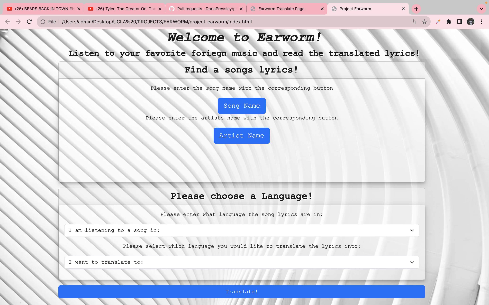

# Project Earworm

## Description

A website that will translate song lyrics from one language to another in a matter of seconds using an two third party APIs - Google Translate & Genuis Song Lyrics.

## User Story

AS a user,
I WANT to be able to search a song that is in another  language & get a translation, 
SO THAT I can get a deeper understanding of that song.

## Acceptance Criteria

It is done when -

The user is able to input a song name, artist name, and select the source language & the language into which the song should translate.

The user clicks on the translate button and it takes the user to the landing page where they will see the name of their song, the artist, the lyrics in the source language, and the translated lyrics.

The user clicks on the go back button that takes them to the homepage and they can start again.

The webpage uses a CSS framework.

The site is deployed to GitHub Pages.

The site responds to user input and has a polished interface.

The site uses two APIs and client-side storage to store persistent data.

## Page

https://dariapressley.github.io/earworm

## Credits

John Huber

Christopher King

Nathan Hoang

Daria Pressley

Bryan Swarthout &
Shawn Tschoepe

## License

Please refer to the LICENSE in the repo.

## Screenshot

