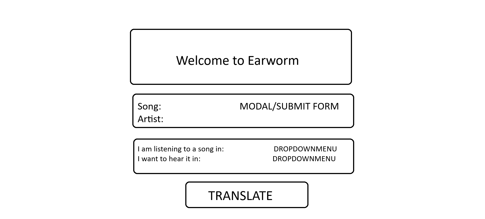
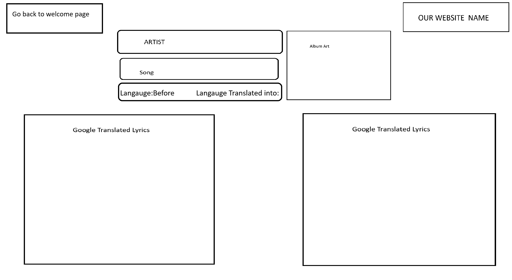

# Project Proposal
# The Earworm

## Description

A site where a user is able to search for a song and translate it to their language of choice.

## User Story

AS a music listener
I WANT to be able to search a song in a foreign language and get a translation 
SO THAT I am able to have a deeper understanding of the song 

## Wireframe

## APIS

Google Translate API

Genius Song Lyrics API - Lyrics and Cover Art

## Rough Breakdown of Tasks

- HTML page
- CSS page
- JavaScript
    - sumbit/modal/search function
    - drop down menu to select languages
    - album art
    - integrate APIs
    - test components
    